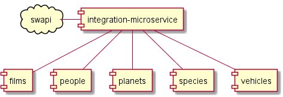

# Desafio Guararapes
Bem vindos ao desafio guararapes, nessa fase precisamos validar seus conhecimentos em nossa Stack, leia toda a documentação abaixo para realizar.

### Esqueletos
O candidato podem criar os serviços utilizando os esqueletos fornecidos, mas caso queiram criar projetos do zero podem ficar a vontade, todas as ferramentas citadas abaixo estão inclusas nos esqueletos. Não é preciso fazer um fork desse projeto, porém favor entregar um projeto fechado na [gitlab](http://gitlab.com) (para que outros candidatos não vizualizem a sua solução).

### Linguagens
* Java 11
* Javascript / NodeJS ECMA 6+
* [Typescript 3+](https://www.typescriptlang.org/)
* Python 3.8

### Frameworks
* [Spring boot](https://spring.io/projects/spring-boot)
* [Angular](https://angular.io/)
* [Django](https://www.djangoproject.com/)

### Libs 
* [Spring JPA](https://docs.spring.io/spring-data/jpa/docs/current/reference/html/#reference)
* [Spring Batch](https://docs.spring.io/spring-batch/docs/current-SNAPSHOT/reference/html/index.html)
* [Spring Web](https://spring.io/guides/gs/serving-web-content/)
* [Spring Fox](http://springfox.github.io/springfox/docs/current/)
* [Lombok](https://projectlombok.org/)
* [Liquid Base](https://www.liquibase.org/)
* [JPA H2 Database](https://www.h2database.com/html/main.html)
* [JPA Postgres Database](https://www.postgresql.org/)
* [drf-yasg](https://github.com/axnsan12/drf-yasg) - Swagger para Django
* [Angular Material](https://material.angular.io/)

### Tools
* [Maven](https://maven.apache.org/)
* [Pipenv](https://github.com/pypa/pipenv) - Package manager para python

## Passo 1
Observe a seguinte api [SWAPI](https://swapi.dev/) e sua [documentação](https://swapi.dev/documentation)

## Passo 2
Reproduza em "microservices" alguns endpoints dessa API, ou seja, usar essa estrutura para criar alguns microservices. O objetivo é poder servir dados completos sobre os personagens, ou seja, criar um microserviço para cada um dos 5 endpoints:
* films
* planets
* species
* starships
* vehicles

## Passo 3
Criar um microserviço de integração, que absorva os dados da API original e distribua entre os microservices criados

## Critérios de aceite
* Pode ser usado H2, Sqlite ou postgres
* Siga o modelo de hiperlink da api original
* Documente suas API's (pode ser OpenApi + Swagger)

## Bonus
Esses criterios não são obrigatorios porém são considerados bonus:
* Use swagger com spring fox (a documentação das apis podem ser via swagger)
* Use postgres
* Crie migrations com liquidbase
* Crie um dos microserviços em python 3.8 com Django
* Crie testes unitários ou de integração (sabe dizer a diferença?)
* Dockerize as aplicações
* Se fizer um front em Angular, ponto máximo
